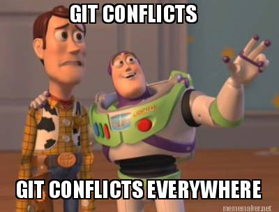

While working on my Undertale tile puzzle game there was one consistent problem that slowed down the overall design and management of the game, and it is simply the handling of files. It was only myself and a partner working on the game for a class project however tracking the changes between files was incredibly tedious and filled with assumptions. Reflecting back, it would have been remarkably handy if some form of configuration management was used.

